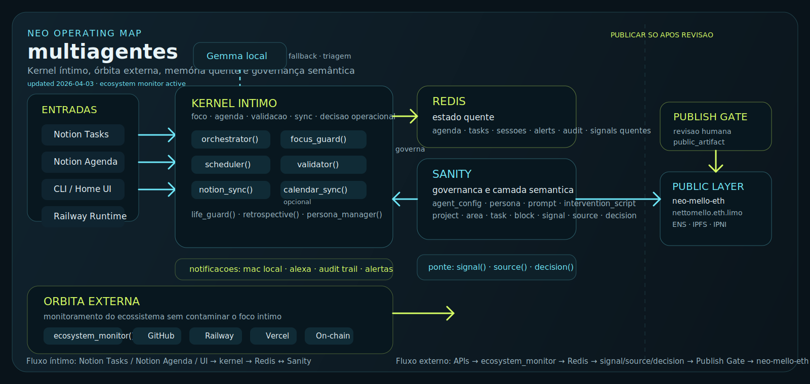

<!-- markdownlint-disable MD003 MD007 MD013 MD022 MD023 MD025 MD029 MD032 MD033 MD034 -->
# MULTIAGENTS



```text
========================================
      MULTIAGENTES · PERSONAL CORE
========================================
```

Camada operacional de um sistema pessoal
que converte intenção em agenda executada,
com memória durável, auditoria contínua
e captura via Telegram.

> **Status:** v0.7.0 — NEOone (Azure gpt-oss-120b) como LLM primário
> **Python:** >=3.12
> **Deploy:** Railway + Redis
> **Interface:** CLI + Telegram Bot
> **LLM:** Azure OpenAI → OpenAI → Local (fallback chain)

────────────────────────────────────────

## What Is This?

A camada operacional de um sistema pessoal
que não trata produtividade como lista,
mas como fluxo entre intenção, agenda,
execução, validação e memória.

```text
┏━━━━━━━━━━━━━━━━━━━━━━━━━━━━━━━━━━━━━━┓
┃ MULTIAGENTES CAPABILITIES            ┃
┣━━━━━━━━━━━━━━━━━━━━━━━━━━━━━━━━━━━━━━┫
┃
┃ Orchestrator
┃   └─ roteia intenções do usuário
┃      e consolida respostas via LLM
┃
┃ Focus Guard
┃   └─ monitora atraso, desvio,
┃      sessão de foco e reage
┃      com auto-reagendamento
┃      e escalada por tempo
┃
┃ Scheduler
┃   └─ cria, ordena e move blocos
┃      de agenda
┃
┃ Validator
┃   └─ valida conclusão de tarefas
┃      com evidências cruzadas
┃
┃ Capture Agent
┃   └─ classifica e envia capturas
┃      para o NEØ Command Center
┃      (Notion DBs: projetos, tarefas,
┃       decisões, worklog)
┃
┃ Linear Sync
┃   └─ cria e sincroniza issues
┃      no Linear (tracking de eng.)
┃
┃ Telegram Bot
┃   └─ inbound do segundo cérebro
┃      via long-poll HTTP puro
┃
┃ Ecosystem Monitor
┃   └─ monitora GitHub, Railway,
┃      on-chain em múltiplas orgs
┃
┃ GitHub Projects
┃   └─ espelha issues/PRs dos
┃      boards GitHub → Notion DB
┃
┗━━━━━━━━━━━━━━━━━━━━━━━━━━━━━━━━━━━━━━┛
```

────────────────────────────────────────

## Operational Flow

```text
Usuário
  │
  ├─ Telegram Bot          (captura inbound)
  └─ CLI (main.py)
       │
       ▼
  Orchestrator ──────────── Azure OpenAI (NEOone · gpt-oss-120b)
       │                         └─ fallback: gpt-4o-mini → local
       ├─ Scheduler
       ├─ Focus Guard
       ├─ Validator
       ├─ Capture Agent    (→ Notion Command Center)
       ├─ Linear Sync      (→ Linear issues)
       ├─ GitHub Projects  (GitHub → Notion)
       └─ Ecosystem Monitor
             │
             ▼
          Redis
             │
             ├─ agenda
             ├─ tarefas
             ├─ alertas
             ├─ handoffs
             └─ auditoria
```

────────────────────────────────────────

## Quick Start

```bash
# 1. Criar ambiente e instalar dependências
make setup

# 2. Chat interativo com o orchestrator
make chat

# 3. Focus Guard em background
make guard

# 4. Rodar testes
make test
```

────────────────────────────────────────

## Core Surfaces

```text
┏━━━━━━━━━━━━━━━━━━━━━━━━━━━━━━━━━━━━━━┓
┃ SURFACE              PURPOSE
┣━━━━━━━━━━━━━━━━━━━━━━━━━━━━━━━━━━━━━━┫
┃ CLI                  operação local e automação
┃ Telegram Bot         captura inbound (segundo cérebro)
┃ Redis                persistência operacional
┃ Notion               destino de captura (NEØ Command Center)
┃ Linear               tracking de issues de engenharia
┃ Railway              deploy daemon + telegram
┃ Voice Monkey         notificações Alexa (foco e rotinas)
┗━━━━━━━━━━━━━━━━━━━━━━━━━━━━━━━━━━━━━━┛
```

────────────────────────────────────────

## Repository Structure

```text
multiagentes/
├── agents/
│   ├── orchestrator.py      roteador central via LLM
│   ├── focus_guard.py       monitor de foco, escalada e auto-reschedule
│   ├── scheduler.py         agenda e blocos
│   ├── validator.py         validação de conclusão com evidências
│   ├── capture_agent.py     classifica e envia ao Notion Command Center
│   ├── linear_sync.py       cria e sincroniza issues no Linear
│   ├── telegram_bot.py      inbound via Telegram (long-poll HTTP)
│   ├── ecosystem_monitor.py monitoramento de projetos e orgs
│   └── github_projects.py   GitHub Projects v2 → Notion DB
├── adapters/
│   └── notion.py            cliente HTTP compartilhado para Notion API
├── cli/
│   └── commands.py          implementação de todos os comandos CLI
├── config/
│   ├── alert_thresholds.yml limites de alerta do ecosystem monitor
│   └── ecosystem.yml        mapeamento de orgs e projetos
├── core/
│   ├── memory.py            persistência Redis (fonte de verdade)
│   ├── openai_utils.py      cadeia LLM: Azure → OpenAI → Local
│   └── notifier.py          logs, terminal, macOS push, Alexa
├── notifications/
│   └── channels.py          canais de saída (terminal, push, Alexa)
├── scheduler/
│   └── runner.py            loop de background e jobs periódicos
├── docs/
│   ├── INDEX.md             índice geral da documentação
│   ├── governanca/          contratos, matriz e políticas de precedência
│   ├── arquitetura/         schema e modelo semântico
│   ├── operacao/            manuais e runbooks operacionais
│   ├── planejamento/        sprints e trilha de execução
│   └── ecossistema/         mapa das orgs e referências externas
├── tests/
│   ├── test_memory.py
│   ├── test_focus_guard.py
│   ├── test_scheduler.py
│   ├── test_orchestrator.py
│   ├── test_validator.py
│   └── test_notifier_openai_utils.py
├── main.py                  entrypoint CLI
├── config.py                configuração central
├── ROADMAP.md               roadmap e próximas frentes
├── Dockerfile               build Railway
├── Procfile                 entrypoints de deploy
├── Makefile                 operação local
└── requirements.txt         dependências Python
```

────────────────────────────────────────

## Integrations

| Integração      | Papel                                       | Variáveis principais                                                         |
| --------------- | ------------------------------------------- | ---------------------------------------------------------------------------- |
| Azure OpenAI    | LLM primário — NEOone (gpt-oss-120b)        | `AZURE_OPENAI_API_KEY`, `AZURE_OPENAI_ENDPOINT`, `AZURE_OPENAI_DEPLOYMENT`  |
| OpenAI          | LLM fallback cloud                          | `OPENAI_API_KEY`, `OPENAI_MODEL`                                             |
| Redis           | memória e persistência (fonte de verdade)   | `REDIS_URL`                                                                  |
| Notion          | destino de captura (NEØ Command Center)     | `NOTION_TOKEN`, `NOTION_DB_PROJETOS`, `NOTION_DB_TAREFAS`                   |
| Linear          | tracking de issues de engenharia            | `LINEAR_API_KEY`, `LINEAR_TEAM_ID`                                           |
| GitHub          | espelho Projects v2 → Notion                | `GITHUB_TOKEN`                                                               |
| Telegram        | captura inbound do segundo cérebro          | `TELEGRAM_BOT_TOKEN`, `TELEGRAM_ALLOWED_CHAT_IDS`                           |
| Railway         | deploy daemon + telegram                    | `RAILWAY_TOKEN`, `RAILWAY_WORKSPACE_ID`                                      |
| Voice Monkey    | anúncios na Alexa                           | `VOICE_MONKEY_TOKEN`, `VOICE_MONKEY_DEVICE`                                  |

────────────────────────────────────────

## Environment Variables

```bash
# --- LLM PRIMÁRIO: Azure OpenAI (NEOone) ---
AZURE_OPENAI_API_KEY=
AZURE_OPENAI_ENDPOINT=https://<seu-recurso>.openai.azure.com/
AZURE_OPENAI_DEPLOYMENT=gpt-oss-120b
AZURE_OPENAI_API_VERSION=2025-01-01-preview

# --- LLM FALLBACK: OpenAI público ---
OPENAI_API_KEY=
OPENAI_MODEL=gpt-4o-mini
OPENAI_FALLBACK_MODEL=gpt-3.5-turbo

# --- OBRIGATÓRIO ---
REDIS_URL=redis://localhost:6379/0

# --- NOTION (destino de captura) ---
NOTION_TOKEN=
NOTION_DB_PROJETOS=
NOTION_DB_TAREFAS=
NOTION_DB_DECISOES=
NOTION_DB_WORKLOG=
NOTION_DB_INTEGRATIONS=

# --- LINEAR ---
LINEAR_API_KEY=
LINEAR_TEAM_ID=

# --- GITHUB ---
GITHUB_TOKEN=                # PAT: project, read:org, repo
GH_PROJECT_FLOWPAY=1
GH_PROJECT_FLOWOFF=1
GH_PROJECT_NEO=1
GH_PROJECT_FACTORY=1

# --- TELEGRAM ---
TELEGRAM_BOT_TOKEN=
TELEGRAM_ALLOWED_CHAT_IDS=   # comma-separated int IDs

# --- RAILWAY ---
RAILWAY_TOKEN=
RAILWAY_WORKSPACE_ID=

# --- NOTIFICAÇÕES — VOICE MONKEY (opcional) ---
VOICE_MONKEY_TOKEN=
VOICE_MONKEY_DEVICE=eco-room
VOICE_MONKEY_VOICE=Ricardo

# --- FOCUS GUARD ---
FOCUS_CHECK_INTERVAL=15

# --- LOGGING ---
LOG_FILE=./logs/agent_system.log
LOG_LEVEL=INFO
```

────────────────────────────────────────

## Make Commands

```text
┏━━━━━━━━━━━━━━━━━━━━━━━━━━━━━━━━━━━━━━━━━━━━━━━━━━━━━━━━┓
┃ COMMAND                ACTION                          ┃
┣━━━━━━━━━━━━━━━━━━━━━━━━━━━━━━━━━━━━━━━━━━━━━━━━━━━━━━━━┫
┃ make setup             venv + deps + .env + redis      ┃
┃ make commit            NΞØ secure commit flow          ┃
┃ make chat              REPL interativo (orchestrator)  ┃
┃ make guard             Focus Guard daemon              ┃
┃ make sync              sincroniza issues Linear        ┃
┃ make check             lint + testes (CI local)        ┃
┃ make lint              ruff check + fix                ┃
┃ make fmt               ruff format                     ┃
┃ make test              pytest                          ┃
┃ make security          pip-audit                       ┃
┃ make doctor            diagnóstico do sistema          ┃
┃ make logs              tail dos logs recentes          ┃
┃ make redis-stats       stats do Redis local            ┃
┃ make redis-keys        lista chaves Redis              ┃
┃ make redis-flush       ⚠️ wipe Redis local             ┃
┃ make docker-clean      prune Docker                    ┃
┃ make shell             iPython com contexto            ┃
┗━━━━━━━━━━━━━━━━━━━━━━━━━━━━━━━━━━━━━━━━━━━━━━━━━━━━━━━━┛
```

────────────────────────────────────────

## CLI Commands

```text
python main.py                     # REPL interativo (chat com orchestrator)
python main.py status              # Status do sistema
python main.py agenda              # Agenda de hoje
python main.py tasks               # Lista de tarefas
python main.py add-task            # Wizard nova tarefa
python main.py sync                # Sync issues Linear
python main.py suggest             # Sugestão de agenda via LLM
python main.py focus start [id]    # Inicia sessão de foco
python main.py focus end           # Encerra sessão de foco
python main.py validate [id]       # Valida conclusão de tarefa
python main.py demo                # Popula dados de demonstração
python main.py ecosistema          # Ecosystem monitor (GitHub, Railway, on-chain)
python main.py github              # GitHub Projects v2: discover / sync / check
python main.py capture             # Captura texto → Notion Command Center
python main.py classify            # Classifica texto e salva no DB correto
python main.py telegram            # Inicia Telegram Bot (long-poll)
python main.py daemon              # Daemon: Focus Guard + scheduler background
```

────────────────────────────────────────

## Persistence Model

- Estado operacional principal vive em Redis via [core/memory.py](./core/memory.py)
- Alertas, handoffs, agenda, sessões e auditoria são persistidos por chave
- Logs locais gravados em arquivo configurado por `LOG_FILE`
- Mapa GitHub issue → Notion page em `state:github_projects:issue_notion_map`

────────────────────────────────────────

## Deploy

O deploy de produção está preparado para Railway:

```text
┏━━━━━━━━━━━━━━━━━━━━━━━━━━━━━━━━━━━━━━━━━━━┓
┃ DEPLOY STACK                              ┃
┣━━━━━━━━━━━━━━━━━━━━━━━━━━━━━━━━━━━━━━━━━━━┫
┃ Builder         Dockerfile                ┃
┃ Daemon          python main.py daemon     ┃
┃ Telegram        python -m agents.telegram_bot ┃
┃ Persistence     Redis service             ┃
┗━━━━━━━━━━━━━━━━━━━━━━━━━━━━━━━━━━━━━━━━━━━┛
```

Fluxo mínimo:

1. configurar variáveis de ambiente
2. anexar serviço Redis ao app
3. garantir que `REDIS_URL` aponte para o Redis do projeto
4. fazer deploy do branch `main`

────────────────────────────────────────

## Tests

```bash
# suíte completa
make test

# lint + testes
make check
```

────────────────────────────────────────

## Documentation

**Workspace & agent blueprints:** [AGENTS.md](./AGENTS.md) · [MEMORY.md](./MEMORY.md)

```text
▓▓▓ ENTRYPOINT
────────────────────────────────────────
└─ docs/INDEX.md                               índice mestre
└─ ROADMAP.md                                  roadmap geral do produto
└─ AGENTS.md                                   contexto workspace · operadores e IA
└─ MEMORY.md                                   blueprints latentes · Redis / Railway / agenda

▓▓▓ OPERAÇÃO
────────────────────────────────────────
└─ docs/operacao/MANUAL_USUARIO.md           uso do sistema
└─ docs/operacao/MANUAL_DEV.md               stack e superfícies
└─ docs/operacao/redis-weekly-check.md       checklist semanal do Redis

▓▓▓ GOVERNANÇA E ARQUITETURA
────────────────────────────────────────
└─ docs/governanca/CONTRATO_AGENTES.md       contrato operacional
└─ docs/governanca/MATRIZ_GOVERNANCA_AGENTES.md
└─ docs/arquitetura/SCHEMA_SIGNAL_DECISION.md ponte semântica externa

▓▓▓ PLANEJAMENTO E ECOSSISTEMA
────────────────────────────────────────
└─ docs/planejamento/NEXTSTEPS.md            trilha de execução
└─ docs/ecossistema/ECOSSISTEMAS_ORGS.md      mapa das orgs
└─ docs/ecossistema/ECOSSISTEMA_NEO_PROTOCOL.md
```

────────────────────────────────────────

## Authorship

- **Architecture & Lead:** NEØ MELLO
- **Project Type:** Personal Operating System
- **Direction:** transformar tarefas em sistema observável, reagente e persistente

────────────────────────────────────────

```text
▓▓▓ MULTIAGENTES
────────────────────────────────────────
Orchestration, memory and execution
for a personal operating system.
────────────────────────────────────────
```
